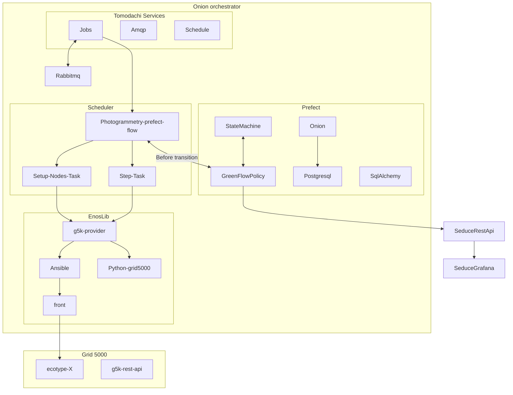

# Naomesh - Orchestrateur

```blank
                  /~    NAOMESH ONION OCHERSTRATOR
                    \  \ /**     BUNDLED WITH
                    \ ////        ___ ___ ___ ___ _____________    ___ ___ ___  __   _  _
                    // //        | _ \ _ \ __| __| __/ __|_   _|  / _ \| _ \_ _/ _ \| \| |
                    // //        |  _/   / _|| _|| _| (__  | |   | (_) |   /| | (_) | .` |
                ///&//           |_| |_|_\___|_| |___\___| |_|    \___/|_|_\___\___/|_|\_|
                / & /\ \
                /  & .,,  \
            /& %  :       \
            /&  %   :  ;     `\
        /&' &..%   !..    `.\
        /&' : &''" !  ``. : `.\
        /#' % :  "" * .   : : `.\
        I# :& :  !"  *  `.  : ::  I
        I &% : : !%.` '. . : : :  I
        I && :%: .&.   . . : :  : I
        I %&&&%%: WW. .%. : :     I
        \&&&##%%%`W! & '  :   ,'/
        \####ITO%% W &..'  #,'/
            \W&&##%%&&&&### %./
                ++///~~\//_
                \\ \ \ \  \_
                /  /    \
```

## Onion schematics



## Setup

1. `pip install -r requirements.txt`
2. authentification
   1. `python3 src/auth.py`
   2. enter g5k password
3. ssh connexion
   1. generate ssh key with `ssh-keygen`
   2. `cat /home/user/.ssh/id_rsa.pub`
   3. go to https://api.grid5000.fr/stable/users/
   4. copy and paste public key in `ssh key`

## Dev setup

1. `pip install -r requirements-dev.txt`
